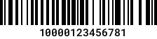
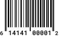
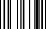
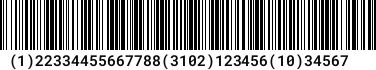

# GS1 / GTIN

Simple classes to handle GS1-128 / GTIN numbers and barcodes. Currentely we have GTIN-14 and GTIN-12 (UPC-A) barcodes generators and validators, but we'll add others (GTIN-13 / EAN and GTIN-8 / EAN-8).

We use these for our own projects, in particular for our own [SGLMS/label-printer](https://github.com/SGLMS/label-printer). You are welcome to try them, or even better, contribute.

## Usage

### GTIN (GTIN-14)

Generate GTIN-14 (prefix + company number + item reference + check digit):

```php
use Sglms\Gs1Gtin\Gtin;

$gtin = Gtin::create(45678);    // Item Reference only!
// GTIN: 10000000456781

$gtin = Gtin::create(45678, '0123');    // Item Reference + Client Prefix
// GTIN: 10000123456781
```
#### Display (on-the-fly)
```php
// Display barcode
echo "getBarcodeSource() . "' />";
```


#### Save (with numbers) and display
```php
// Save barcode
echo $gtin->saveBarcode('path/barcode');
echo "";
```



For now, only JPG images are supported, but will add other standards as needed (by our rojects).

#### Validate

```
Gtin::validate(11230000456781); # TRUE
```


### GTIN-12 (UPC-A)

Generate GTIN-12 (company number + item reference + check digit):

```php
use Sglms\Gs1Gtin\Gtin12;

$gtin12 = Gtin12::create(1, 614141);    // Item Reference + Client Prefix
// GTIN-12: 614141000013
```

```php
// Save barcode
echo $gtin12->saveBarcode('path/barcode');
echo "";
```



### GTIN-8 (EAN-8)

Generate GTIN-8 (company number + item reference + check digit):

```php
use Sglms\Gs1Gtin\Gtin8;

$gtin8 = Gtin8::create(890, 5067);    // Item Reference + Client Prefix
// GTIN-8: 50678907
```

```php
// Save barcode
echo $gtin8->saveBarcode('path/barcode');
echo "";
```



### GS1

```php
use Sglms\Gs1Gtin\Gs1;

$gs1 = new Gs1('(01)1234(3102)123456(3302)134567(37)20(11)220801(17)221231');
// object(Sglms\Gtin\Gs1)[3]
// protected string 'gs1' => string '(01)1234(3102)123456(3302)134567(37)20(11)220801' (length=48)
// public int 'gtin' => int 10000000012345
// public int 'units' => int 20
// public int|float 'netWeight' => float 1234.56
// public int|float 'grossWeight' => float 1345.67
// ...

echo "getBarcodeSource() . "' />";
```

GS1-128: (01)1234(3102)123456(3302)134567(37)20(11)220801(17)221231


GS1 (generator) works only with GTIN-14; per standards recomendations.

```php
$gs1->saveBarcode('path/gs1');
echo "";
```




### Standards

GS1 Identifiers can be found [here](https://www.databar-barcode.info/application-identifiers/). We use only a few, they are enumerated in `src/Gs1Codes.php`, you can add your own as needed.

```php
enum Gs1Code: string
{
    case GTIN           = '01'; // n2+n14
    case Content        = '02'; // n2+n14
    case BatchNumber    = '10';
    case ProductionDate = '11'; // n2+n6
    case PaymentDate    = '12'; // n2+n6
    case BestBeforeDate = '15'; // n2+n6
    case ExpirationDate = '17'; // n2+n6
    case SerialNumber   = '21';
    case Units          = '37'; // n2+n..8
    case NetWeight      = '3102'; //n4+n6 (2 decimals)
    case GrossWeight    = '3302'; //n4+n6 (2 decimals)
}
```


# Credits
Bar code generator (images) : [picqer/php-barcode-generator](https://github.com/picqer/php-barcode-generator).