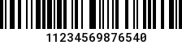
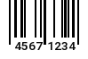

# GS1 / GTIN

GS1-128 / GTIN (UPCA; EAN8; ITF14) creator and parser; including barcode generation.

In this version we have included Laravel Service Providers.

## Installation

```bash
composer require sglms/gtin-gs1
```

## Usage

### GTIN (GTIN-14)

Generate GTIN-14 (prefix + company number + item reference + check digit):

```php
use Sglms\Gs1Gtin\Gtin;

$gtin = Gtin::create(9876543210);
// GTIN: 10098765432105

$gtin = Gtin::create(
    itemNumber: 98765,
    companyPrefix: '0123'
);
// GTIN: 10123000987659

$gtin = Gtin::create(
    itemNumber: 987654,
    companyPrefix: '123',
    type: 'GTIN-14',
    packagingLevel: 2
);
// GTIN: 21230009876545

```
#### Display (on-the-fly)
```php
// Display barcode (SVG)
echo $gtin->barcode();
```


#### Save (with numbers) and display
```php
// Save barcode
echo $gtin->saveBarcode('path/barcode');
echo "";
```



For now, only JPG images are supported, but will add other standards as needed (by our rojects).

#### Validate

```php
Gtin::validate(11230000456781); # TRUE
```


### GTIN-12 (UPC-A)

Generate GTIN-12 (company number + item reference + check digit):

```php
use Sglms\Gs1Gtin\Gtin12;

$gtin = Gtin12::create(
    itemNumber: 123,
    companyPrefix: '45678',
);
// GTIN / UPC-A: 456780001230
```

```php
// Save barcode
$gtin->saveBarcode('path/barcode');

// Save barcode with numbers
$gtin->saveWithNumber('../resources/gtin12_numbers');
echo "";
```


### GTIN-8 (EAN-8)

Generate GTIN-8 (company number + item reference + check digit):

```php
use Sglms\Gs1Gtin\Gtin8;

$gtin = Gtin8::create(
    itemNumber: 123,
    companyPrefix: '4567'
);

echo $gtin;
// GTIN-8 / EAN-8: 45671234

// Save barcode
$gtin->barcode();

$gtin->saveBarcode('../resources/gtin8');
echo "";

// Save barcode with numbers
$gtin->saveWithNumber('../resources/gtin8_numbers');
echo "";
```



### GS1

```php
use Sglms\Gs1Gtin\Gs1;

$gs1 = Gs1::parse('(01)10012345678902(10)ABC123(3201)000500(3302)000700(17)250630(21)SN123456(37)10(11)230101');
echo $gs1;
echo $gs1->barcode(showNumbers:true);
// GS1: (01)00012345678905(10)ABC123(3102)002268(3302)000700(11)230101(17)250630(21)SN123456(37)10

// Or, you can save a JPG image with numbers
$gs1->saveBarcode('../resources/gs1', ['01','37', '21','3102','3302'], 80);
```


    object(Sglms\Gs1Gtin\Gs1)[4]
      public array 'data' => 
        array (size=8)
          '01' => string '00012345678905' (length=14)
          3302 => string '000700' (length=6)
          3102 => string '002268' (length=6)
          11 => string '230101' (length=6)
          17 => string '250630' (length=6)
          21 => string 'SN123456' (length=8)
          37 => int 10
          10 => string 'ABC123' (length=6)
      public ?string 'gs1' => string '(01)00012345678905(10)ABC123(3201)000500(3302)000700(17)250630(21)SN123456(37)10(11)230101' (length=90)
      public ?string 'sscc' => null
      public ?string 'gtin' => string '00012345678905' (length=14)
      public ?string 'content' => null
      public ?string 'netWeight' => string '002268' (length=6)
      public ?string 'grossWeight' => string '000700' (length=6)
      public ?string 'batch' => string 'ABC123' (length=6)
      public ?string 'serial' => string 'SN123456' (length=8)
      public ?string 'productionDate' => string '230101' (length=6)
      public ?string 'expirationDate' => string '250630' (length=6)
      public ?int 'pieces' => int 10

```php
$gs1 = Gs1::create(
    gtin: '00012345678905',
    serial: 'ABC123',
    netWeightPounds: 1000,
    grossWeight:6000,
    pieces:10,
);
echo $gs1;
echo $gs1->barcode(
    codes: ['01','37', '21','3102','3302'],
    showNumbers:true
);
```

### Standards

GS1 Identifiers can be found [here](https://www.databar-barcode.info/application-identifiers/). We use only a few, they are enumerated in `src/Gs1Codes.php`, you can add your own as needed.

```php
enum Gs1Code: string
{
    case SSCC           = '00';
    case GTIN           = '01'; // n2+n14
    case Content        = '02'; // n2+n14
    case BatchNumber    = '10';
    case ProductionDate = '11'; // n2+n6
    case PaymentDate    = '12'; // n2+n6
    case BestBeforeDate = '15'; // n2+n6
    case ExpirationDate = '17'; // n2+n6
    case SerialNumber   = '21';
    case Units          = '37'; // n2+n..8
    case NetWeight      = '3102'; //n4+n6 (2 decimals)
    case GrossWeight    = '3302'; //n4+n6 (2 decimals)
}
```


# Credits
Bar code generator (images) : [picqer/php-barcode-generator](https://github.com/picqer/php-barcode-generator).